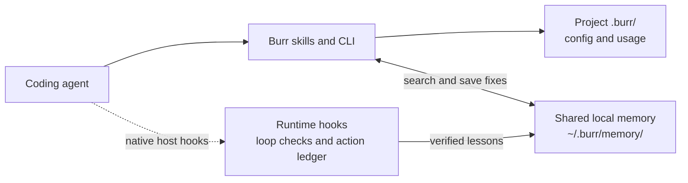

# Burr

<p align="center">
  
</p>

<p align="center">
  <strong>Agents that remember how they got unstuck.</strong><br>
  A burr is a seed that hooks on and rides with the next passerby.
</p>

<p align="center">
  <a href="LICENSE"></a>
  <a href="package.json"></a>
  <a href="https://www.npmjs.com/package/burr-memory"></a>
  <a href="https://sansynx.github.io/burr-site/"></a>
  
</p>

> **Showcase & Interactive Documentation**: [https://sansynx.github.io/burr-site/](https://sansynx.github.io/burr-site/)

```bash
npm install -g burr-memory
burr global
```

That turns Burr on for every project. Playbooks live in **`~/.burr/memory/`** on this machine, so a compacted session or an agent in another repo can reuse the same fix.

One repo only:

```bash
npm install -D burr-memory
npx burr init
```

No account. No API key. No network after install.

Playbooks live on **this machine**, not on a server and not in one repo:

```
~/.burr/memory/
  playbooks/                 verified fixes (all your projects)
  signals/                   reusable failures

your-project/
  .burr/
    config.json              mode: on | strict | off
    instructions.md          always-on rule
    usage.jsonl              search / hit / miss / capture / resolve / promote / discard
    skills/                  owned copies of the seven commands
```

If you resolve a Prisma singleton bug in `shop`, the next agent in `billing` (or a compacted session in `shop`) searches `~/.burr/memory/` and rides that playbook. `burr global` writes editor rules under your home directory. Capture and resolve write the memory there too.

---

## What is Burr?

Burr is local debugging memory for coding agents. Search for a known fix, capture a reusable failure, and save a playbook after verifying the solution. Playbooks stay on your machine and can be reused across projects.

The package also provides runtime APIs for recording tool actions, detecting repetition, and learning from verified sessions. A host must call these APIs and honor their results. Installing the skills alone does not automatically intercept every tool call.

## Architecture



Skills and CLI commands handle the debugging workflow. Codex, Pi, and OpenCode adapters connect runtime tool observation; other hosts can call the exported handlers. Project settings stay in `.burr/`; shared fixes stay in your home directory. Nothing is uploaded. See the [debugging workflow](assets/burr-how-it-works.svg) for the search-to-playbook steps.

## Learning and retention

- `capture` admits reusable failures and rejects common temporary environment noise.
- `resolve` requires error, cause, fix, and verification text. The caller must run the check and report its result truthfully; Burr does not execute verification commands itself.
- Runtime session completion accepts verification evidence from the integrating host. Admission filters candidate lessons before promotion or merging.
- `burr memory prune` applies decay and removes expired run history. This is an explicit maintenance command, not a background scheduler. `runRetentionDays`, `archiveAfterDays`, and `maxCandidates` control pruning; candidate creation also enforces the configured cap. Defaults mark memories stale after 30 days and archive them after 60 days; run history is retained for seven days.
- Runtime JSON memories and CLI Markdown playbooks use separate retrieval paths. The runtime dashboard reports runtime records, while `burr search` and `burr audit` cover the CLI workflow.

## Programmatic Node API

Use the `/api` export for the Node API. The package root exports the OpenCode plugin.

```typescript
import { LoopDetector } from "burr-memory/api";

const detector = new LoopDetector({ autoRecord: false });
const args = { cmd: "npm test" };
const check = detector.evaluateAction("run_command", args);

if (check.blocked) {
  console.warn(check.reasons, check.suggestedAction);
} else {
  // Run the tool, then record its actual result.
  detector.recordAction("run_command", args, "test output", "completed");
}
```

Codex uses native `SessionStart`, `PreToolUse`, `PostToolUse`, and `SessionEnd` hooks. `burr init` merges registrations into `.codex/hooks.json`; `burr global` uses `$CODEX_HOME/hooks.json` (default `~/.codex/hooks.json`). The Codex plugin bundles the same hooks. Existing unrelated hooks are preserved, and duplicate tool events from multiple sources are recorded once. Keep the installed package available: generated commands reference its built runtime.

Review new hooks in Codex `/hooks` once; Codex requires trust for each hook definition. Burr preserves that requirement and existing approval settings. Native execution and denial were tested with Codex CLI 0.146.0 using an isolated local test provider. Hosted tools such as web search do not emit these local tool hooks. See the [Codex hook protocol](https://learn.chatgpt.com/docs/hooks).

The Pi extension and OpenCode plugin also connect native tool events. Rerun `burr init` or `burr global` to upgrade an unchanged previous OpenCode adapter; edited copies are preserved. Session completion alone never promotes a fix. Custom integrations can still call the lifecycle exports from `burr-memory/codex` with explicit verification evidence.

For a local plugin checkout, run `npm install` and `npm run build` before loading it. To repeat the native smoke test, set `BURR_CODEX_CLI` to an installed Codex `bin/codex.js`, run `npm run build`, then `npm exec -- vitest run test/codex/native.test.ts`. It uses temporary storage and a local scripted provider, not an API key or a live model.

---

## Install

```bash
npm install -g burr-memory
burr global
```

Or in one repo: `npm install -D burr-memory` then `npx burr init`.

`init` and `global` write Burr's own files only (write-if-missing). They do **not** edit `AGENTS.md`, `CLAUDE.md`, or any existing foreign rule. Second run does not overwrite your edits.

From a clone of this repo:

```bash
npm install
npm test
npm run build
```

---

## Commands

| Claude / OpenCode         | Codex           | Pi                    | What it does                                         |
| ------------------------- | --------------- | --------------------- | ---------------------------------------------------- |
| `/burr [on\|strict\|off]` | `@burr`         | `/skill:burr`         | Status, or set mode                                  |
| `/burr-search`            | `@burr-search`  | `/skill:burr-search`  | Search shared memory on this machine                 |
| `/burr-capture`           | `@burr-capture` | `/skill:burr-capture` | Save a reusable failure                              |
| `/burr-resolve`           | `@burr-resolve` | `/skill:burr-resolve` | Write a playbook after a verified fix                |
| `/burr-promote`           | `@burr-promote` | `/skill:burr-promote` | Lift an old project-only playbook into shared memory |
| `/burr-audit`             | `@burr-audit`   | `/skill:burr-audit`   | Usage from `usage.jsonl`                             |
| `/burr-help`              | `@burr-help`    | `/skill:burr-help`    | This screen                                          |

Cursor and Windsurf get the always-on rule only (no slash commands).

CLI commands:

```bash
# Core debugging workflow
burr init
burr search "hydration mismatch"
burr capture --error "TypeError: ..." --command "npm test"
burr resolve --error "..." --cause "..." --fix "..." --verify "npm test (12 passed)"
burr promote
burr audit
burr on | strict | off

# Reliability & learning analytics
burr stats
burr compare <run-id-1> <run-id-2>
burr memory summary
burr memory list
burr memory inspect <memory-id>
burr memory prune
burr doctor

# Local offline visual dashboard
burr dashboard --port 4747
```

---

## Hosts

| Host        | Always-on                     | Commands                             | `init` writes                                |
| ----------- | ----------------------------- | ------------------------------------ | -------------------------------------------- |
| Claude Code | skill descriptions            | `/burr*` via `.claude/skills`        | those skill copies                           |
| Codex       | native session and tool hooks | `@burr*` via plugin / visible skills | `.agents/skills` + `.codex/hooks.json` merge |
| OpenCode    | plugin injects the rule       | `/burr*` via plugin                  | `.opencode/plugins/burr.mjs` + json merge    |
| Pi          | skill descriptions            | `/skill:burr*`                       | `.pi/skills` and `.agents/skills`            |
| Cursor      | `.cursor/rules/burr.mdc`      | none                                 | that rule file                               |
| Windsurf    | `.windsurf/rules/burr.md`     | none                                 | that rule file                               |

Canonical skills live once in `skills/`. `init` creates the host-specific
copies and adapters each tool expects.

---

## Validation and dashboard

`test/benchmark.test.ts` exercises a scripted four-session fixture. It checks retrieval, loop handling, and memory reuse with supplied tool outputs. It is a regression test, not an independent agent benchmark or a guarantee of time or token savings.

`burr dashboard --port 4747` serves runtime metrics, memories, and run summaries at `http://127.0.0.1:4747`. It binds to loopback and rejects foreign origins and host headers.

---

## Local store

Playbooks and signals are **`~/.burr/memory/`** on this machine. Shared across your projects and sessions. Not committed. Not uploaded.

The project's `.burr/` is config, usage, and host copies. `init` gitignores it so leftover local files stay off the remote.

---

## Security

Debugging input is treated as untrusted.

- Redact tokens, JWTs, private keys, passwords, home paths, emails, and query-string secrets before any disk write.
- Bound sizes (12k text, 20 attempts).
- Refuse symlink project roots during init and writes outside approved roots.
- Never store source trees, `.env` contents, or customer data.
- `init` never asks for a key and never calls a network.

---

## Development

```bash
npm install
npm test
npm run typecheck
npm run build
```

Layout:

```
skills/           seven canonical SKILL.md files
templates/        config.json + always-on rule
src/shared/       redaction, admission, search, ledger, safe fs
src/cli/          init + global + search / capture / resolve / promote / audit
test/hosts/       one suite per coding agent
test/edges/       bounds, secrets, path escape
```

---

## Contributing

Bug reports and pull requests are welcome.

Burr is local debugging memory with optional runtime integration. Please do not add a remote hosted API, cloud dashboard, account system, or background telemetry process. `init` and `global` may only create Burr’s own files; they must never modify a user’s `AGENTS.md`, `CLAUDE.md`, or other existing instruction files.

The mark is locked: ink `#0F0F0E`, cream `#F4EEE7`, and ember `#FF5A1F` on the spine at about 2 o’clock. No wordmark or letters.

Please include tests for new behavior (`npm test`) and write a short commit message in your own name.

---

## License

[MIT](LICENSE)
