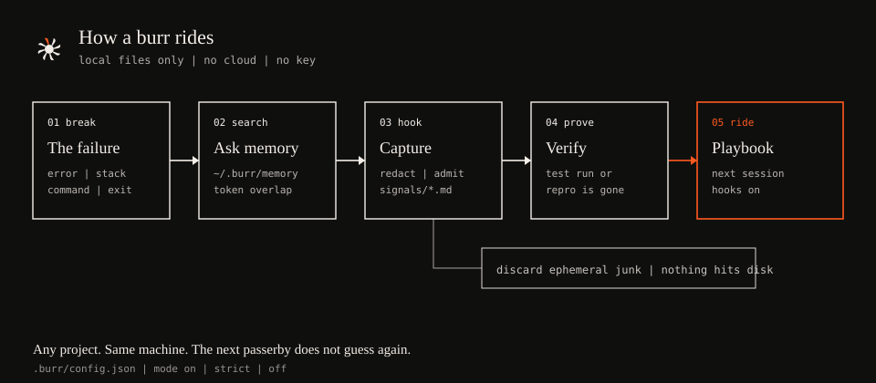

# Burr

<p align="center">
  
</p>

<p align="center">
  <strong>Local debugging memory for coding agents.</strong><br>
  A burr is a seed that hooks on and rides with the next passerby.
</p>

<p align="center">
  <a href="LICENSE"></a>
  <a href="package.json"></a>
  <a href="https://www.npmjs.com/package/burr-memory"></a>
  
</p>

```bash
npm install -g burr-memory
burr global
```

That turns Burr on for every project. Playbooks live in **`~/.burr/memory/`** on this machine, so a compacted session or an agent in another repo can reuse the same fix.

One repo only:

```bash
npm install -D burr-memory
npx burr init
```

No account. No API key. No network after install.

Playbooks live on **this machine**, not on a server and not in one repo:

```
~/.burr/memory/
  playbooks/                 verified fixes (all your projects)
  signals/                   reusable failures

your-project/
  .burr/
    config.json              mode: on | strict | off
    instructions.md          always-on rule
    usage.jsonl              search / hit / miss / capture / resolve / promote / discard
    skills/                  owned copies of the seven commands
```

If you resolve a Prisma singleton bug in `shop`, the next agent in `billing` — or a compacted session in `shop` — searches `~/.burr/memory/` and rides that playbook. `burr global` writes editor rules under your home directory. Capture and resolve write the memory there too.

---

## Why

Coding agents re-debug the same crash across sessions. Burr makes the useful part stick:

1. **Search** local memory before a non-trivial fix.
2. **Capture** a reusable failure as a redacted signal.
3. **Resolve** only after a verified fix, as a markdown playbook.
4. **Audit** whether memory was actually used.

## How it works

<p align="center">
  
</p>

1. Something breaks. Clip the error, stack, and command.
2. Search `~/.burr/memory` (playbooks and signals) by filename, frontmatter, and token overlap. No embeddings. Shared across your projects.
3. If the failure will recur for another agent, capture a **signal**. Secrets are redacted first. Ephemeral junk (busy port, missing local asset, down dev server) is discarded and never written.
4. After a real verification (test run, reproduced-and-gone, measured check), write a **playbook**.
5. The next session searches first and rides that playbook instead of guessing.

Mode `on` = search before non-trivial fixes. `strict` = do not patch until a search ran. `off` = silent.

---

## Install

```bash
npm install -g burr-memory
burr global
```

Or in one repo: `npm install -D burr-memory` then `npx burr init`.

`init` and `global` write Burr's own files only (write-if-missing). They do **not** edit `AGENTS.md`, `CLAUDE.md`, or any existing foreign rule. Second run does not overwrite your edits.

From a clone of this repo:

```bash
npm install
npm test
npm run build
```

---

## Commands

| Claude / OpenCode | Codex | Pi | What it does |
|---|---|---|---|
| `/burr [on\|strict\|off]` | `@burr` | `/skill:burr` | Status, or set mode |
| `/burr-search` | `@burr-search` | `/skill:burr-search` | Search shared memory on this machine |
| `/burr-capture` | `@burr-capture` | `/skill:burr-capture` | Save a reusable failure |
| `/burr-resolve` | `@burr-resolve` | `/skill:burr-resolve` | Write a playbook after a verified fix |
| `/burr-promote` | `@burr-promote` | `/skill:burr-promote` | Lift an old project-only playbook into shared memory |
| `/burr-audit` | `@burr-audit` | `/skill:burr-audit` | Usage from `usage.jsonl` |
| `/burr-help` | `@burr-help` | `/skill:burr-help` | This screen |

Cursor and Windsurf get the always-on rule only (no slash commands).

CLI (same helpers the skills use):

```bash
npx burr init
npx burr search "hydration mismatch"
npx burr capture --error "TypeError: ..." --command "npm test"
npx burr resolve --error "..." --cause "..." --fix "..." --verify "npm test — 12 passed"
npx burr promote
npx burr audit
npx burr on|strict|off
```

---

## Hosts

| Host | Always-on | Commands | `init` writes |
|---|---|---|---|
| Claude Code | skill descriptions | `/burr*` via `.claude/skills` | those skill copies |
| Codex | `@` `.burr/instructions.md` | `@burr*` via plugin / visible skills | `.agents/skills` |
| OpenCode | plugin injects the rule | `/burr*` via plugin | `.opencode/plugins/burr.mjs` + json merge |
| Pi | skill descriptions | `/skill:burr*` | `.pi/skills` and `.agents/skills` |
| Cursor | `.cursor/rules/burr.mdc` | none | that rule file |
| Windsurf | `.windsurf/rules/burr.md` | none | that rule file |

Canonical skills live once in `skills/`. `init` creates the host-specific
copies and adapters each tool expects.

---

## Local store

Playbooks and signals are **`~/.burr/memory/`** on this machine. Shared across your projects and sessions. Not committed. Not uploaded.

The project's `.burr/` is config, usage, and host copies. `init` gitignores it so leftover local files stay off the remote.

---

## Security

Debugging input is treated as untrusted.

- Redact tokens, JWTs, private keys, passwords, home paths, emails, and query-string secrets before any disk write.
- Bound sizes (12k text, 20 attempts).
- Refuse symlink project roots during init and writes outside approved roots.
- Never store source trees, `.env` contents, or customer data.
- `init` never asks for a key and never calls a network.

---

## Development

```bash
npm install
npm test
npm run typecheck
npm run build
```

Layout:

```
skills/           seven canonical SKILL.md files
templates/        config.json + always-on rule
src/shared/       redaction, admission, search, ledger, safe fs
src/cli/          init + global + search / capture / resolve / promote / audit
test/hosts/       one suite per coding agent
test/edges/       bounds, secrets, path escape
```

---

## Contributing

Bug reports and pull requests are welcome.

Burr is a local skill pack. Please do not add a hosted API, dashboard, account system, or background process. `init` and `global` may only create Burr’s own files; they must never modify a user’s `AGENTS.md`, `CLAUDE.md`, or other existing instruction files.

The mark is locked: ink `#0F0F0E`, cream `#F4EEE7`, and ember `#FF5A1F` on the spine at about 2 o’clock. No wordmark or letters.

Please include tests for new behavior (`npm test`) and write a short commit message in your own name.

---

## License

[MIT](LICENSE)
