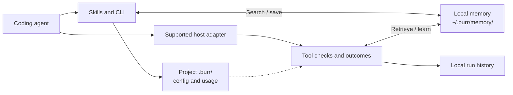

<p align="center">
  
</p>
<h1 align="center">Burr</h1>
<p align="center"><strong>Local debugging memory for coding agents.</strong><br>Save a verified fix once. Find it again in your next session.</p>
<p align="center">
  <a href="LICENSE">MIT license</a> ·
  <a href="https://www.npmjs.com/package/burr-memory">npm: burr-memory</a> ·
  <a href="https://sansynx.github.io/burr-site/">Website & documentation</a> ·
  <a href="https://github.com/sansynx/burr-memory/issues">Report a bug</a>
</p>

Burr stores reusable failures and verified fixes on your machine. Its CLI and agent skills help you search before debugging, capture useful evidence, and save a playbook after verification. Optional host adapters record tool outcomes and interrupt repeated failures.

No account, API key, hosted memory, or telemetry. Burr itself makes no network requests after installation. Your coding agent and its model provider remain separate services.

## Quick start

Requires **Node.js 22.12+**. Development and CI support Node 22, 24, and 26.

```bash
npm install -g burr-memory
burr global
```

This installs user-level skills and supported host hooks. **Review new Codex hooks in `/hooks` before using them.** Cursor and Windsurf need project installation or manual global configuration.

```bash
cd your-project
burr init
burr search "TypeError: response.users is undefined"
```

<details>
<summary>Install in one project instead</summary>

```bash
npm install -D burr-memory
npm exec -- burr init
npm exec -- burr search "your error"
```

The package name is `burr-memory`; its executable is `burr`. Keep the installed package available because generated hook commands reference its runtime.

</details>

## A debugging workflow

1. **Search** for a previously verified fix before guessing.
2. **Capture** a reusable failure, including what you tried.
3. **Verify** the fix using your project's actual checks.
4. **Resolve** the incident into a playbook for future sessions.

```bash
burr capture --error "TypeError: response.users is undefined" --why "API response schema changed"
# Make the fix and run the project's tests first.
burr resolve --error "TypeError: response.users is undefined" --cause "users moved into data" --fix "Read response.data.users and validate the response" --verify "npm test: 12 passed, 0 failed"
burr search "response users undefined"
burr audit
```

Burr checks verification text for evidence of success; it does not execute that command or prove your claim. Failed or command-only verification is rejected. Review retrieved advice against the current code before applying it.

## How it fits together



The CLI stores Markdown signals and playbooks. The runtime stores structured JSON lessons and JSONL tool histories; verified runtime playbooks also get Markdown exports. These are separate retrieval paths. Nothing is uploaded by Burr. See [architecture and storage](ARCHITECTURE.md) and the compact [workflow diagram](assets/burr-how-it-works.svg).

## Host support

| Host        | Integration                                       | Setup and limits                                                                                |
| ----------- | ------------------------------------------------- | ----------------------------------------------------------------------------------------------- |
| Codex       | Skills plus native session/tool hooks             | `burr init` or `burr global`, then `/hooks` approval. Hosted tools may not emit local hooks.    |
| OpenCode    | Plugin instructions, commands, and tool callbacks | Project or global installation. Existing host configuration is preserved.                       |
| Pi          | Skills plus extension callbacks                   | Install/load the Burr Pi package for runtime observation; copied skills alone are instructions. |
| Claude Code | `/burr-*` skills                                  | Instruction workflow; no shipped automatic tool interceptor.                                    |
| Cursor      | Project `.cursor/rules/burr.mdc`                  | `burr init`; global User Rules are configured in the editor.                                    |
| Windsurf    | Project `.windsurf/rules/burr.md`                 | `burr init`; global rules are configured separately.                                            |

Installing a skill is not proof that an agent follows it. Runtime prevention requires a loaded adapter whose host honors its decision. Mode `off` disables runtime guidance for that project; `strict` also instructs the agent to search first, not universally block edits.

<details>
<summary>Commands and agent skill names</summary>

| CLI                                                                                          | Purpose                                           |
| -------------------------------------------------------------------------------------------- | ------------------------------------------------- |
| `burr init [dir]` / `burr global`                                                            | Install project / user integration                |
| `burr status` / `burr on` / `burr strict` / `burr off`                                       | Inspect or change mode                            |
| `burr search "text"`                                                                         | Search local Markdown memory                      |
| `burr capture --error "text"`                                                                | Save a reusable failure                           |
| `burr resolve --error "..." --cause "..." --fix "..." --verify "command and passing result"` | Save a verified playbook                          |
| `burr promote [path]`                                                                        | Copy a legacy project playbook into shared memory |
| `burr audit`                                                                                 | Inspect CLI usage                                 |
| `burr stats` / `burr compare <run-a> <run-b>`                                                | Inspect runtime observations                      |
| `burr memory summary` / `list` / `inspect <id>` / `prune`                                    | Inspect and maintain runtime memory               |
| `burr doctor`                                                                                | Check local storage health                        |
| `burr dashboard --port 4747`                                                                 | Open runtime metrics on loopback HTTP             |

Claude Code and OpenCode use `/burr-search`, `/burr-capture`, `/burr-resolve`, `/burr-promote`, `/burr-audit`, `/burr-help`, and `/burr`. Codex exposes the corresponding `@burr-*` skills; Pi uses `/skill:burr-*`.

</details>

<details>
<summary>Custom Node integration</summary>

Use `burr-memory/api`, `/runtime`, `/learning`, or `/codex`. The package root exports the OpenCode plugin.

```typescript
import { LoopDetector } from "burr-memory/api";

const detector = new LoopDetector({ autoRecord: false });
const args = { cmd: "npm test" };
const check = detector.evaluateAction("run_command", args);
if (check.blocked) {
  console.warn(check.reasons, check.suggestedAction);
} else {
  // Execute your tool, then record its real output and status.
  detector.recordAction("run_command", args, "12 passed", "completed");
}
```

The `/codex` lifecycle handlers add persistence, retrieval, and reflection. A custom host must invoke them, honor blocking results, and supply truthful verification evidence. Session completion alone never proves that a fix worked. Burr does not ship an MCP server, hosted API, account system, or team authorization layer.

</details>

<details>
<summary>Storage, retention, and privacy</summary>

```text
~/.burr/
  memory/playbooks/        Markdown fixes
  memory/signals/          Markdown failures
  memory/knowledge/       Structured runtime lessons
  memory/tool-strategies/  Structured tool strategies
  candidates/             Lessons awaiting admission
  archive/                Archived runtime lessons
  runs/                   Tool histories
  metrics/                Runtime events

<project>/.burr/           Config, instructions, generated skills, CLI usage
```

Memory is shared across projects on this machine, not across accounts or teams. Runtime scope filters distinguish repositories, frameworks, packages, versions, and tools. CLI Markdown search is broader; review relevance before reuse.

`burr memory prune` applies decay, archives old runtime memories, and removes expired run histories. Default thresholds are 30 days to stale, 60 to archive, and seven days for runs; poor evidence can lower these thresholds. Runtime session completion and explicit pruning enforce the configured candidate count limit. CLI Markdown signals and usage logs have no automatic expiry or total storage cap.

Known token, password, private-key, email, and home-path patterns are redacted before persistence. Redaction is not a guarantee that arbitrary sensitive data is detected. Do not submit source trees, `.env` contents, or customer data. Filesystem guards reject linked paths and escapes; staged replacements preserve the previous file on write failure. These safeguards do not isolate Burr from another process running as the same OS user.

The dashboard binds to `127.0.0.1`, checks host/origin headers, and escapes stored text. It has no account login. `init` ignores `.burr/` in Git; review generated host files before committing them. Existing user instruction files and edited managed copies are preserved.

</details>

## Evidence and limits

Burr provides functioning storage, retrieval, tool observation, and repeated-failure checks. The test suite exercises these behaviors with isolated homes and explicit outcomes. `test/benchmark.test.ts` is a scripted four-session regression, **not an autonomous agent benchmark or proof of time/token savings**. The dashboard reports observed events, not causal productivity gains.

Loop scores are heuristics. Repeated successful work can warn; ordinary blocking requires repeated failed execution evidence. Review false positives for your tools. File-based search scans memory, and runtime summaries read histories; large stores need maintenance. `doctor` checks storage, not whether an editor actually loaded its hooks.

## Development and contributing

```bash
npm ci
npm run check
npm run test:package
npm pack --dry-run
```

Use Node 22.12+ and the committed npm lockfile. The package has no production dependencies. CI checks Node 22/24/26 on Windows, macOS, and Linux. Weekly Dependabot PRs propose package and GitHub Actions updates; tests and human review precede merging.

<details>
<summary>Native hook checks and release setup</summary>

To run the isolated native Codex test, set `BURR_CODEX_CLI` to an installed `@openai/codex/bin/codex.js`, build, then run:

```bash
npm exec -- vitest run test/codex/native.test.ts
```

It uses temporary storage and a scripted local provider, with no API key or live model. CI pins the tested host version; the environment variable enables an explicit local compatibility check. Native Pi loader and OpenCode command-discovery checks use `BURR_PI_PACKAGE` and `BURR_OPENCODE_CLI` respectively. These tests run separately from the default suite and also have a CI job.

The release workflow is manual and disabled by default. It also refuses private repositories. When ready to publish, configure npm trusted publishing for `release.yml`, protect the GitHub `npm` environment with required reviewers, and explicitly set `NPM_PUBLISH_ENABLED=true`. Create a `v<version>` tag matching `package.json`, then dispatch that version. No publication occurs on an ordinary push or dependency PR. Changing repository visibility is a separate owner decision.

</details>

Keep contributions local-first. Add a regression before fixing a bug, preserve user-edited configuration, and use guarded filesystem helpers. Please avoid hosted memory, telemetry, or account features. Canonical sources live in `src/`, `skills/`, and `templates/`; generated host copies, `.burr/`, `dist/`, and package tarballs do not belong in commits.

[MIT](LICENSE)
